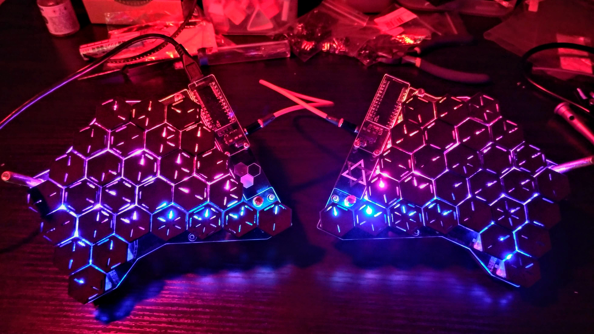
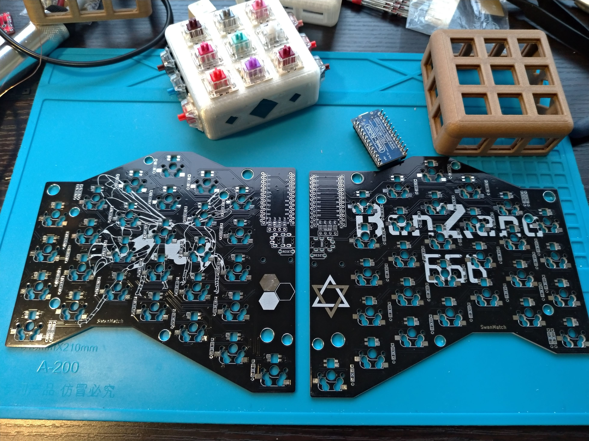
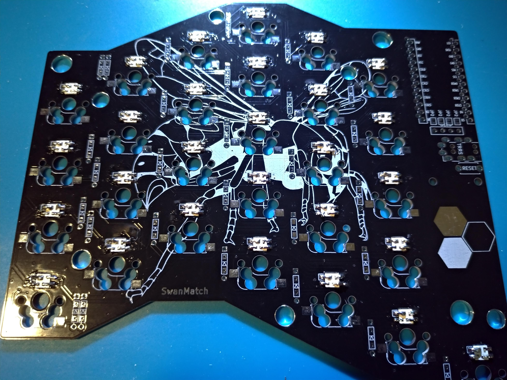
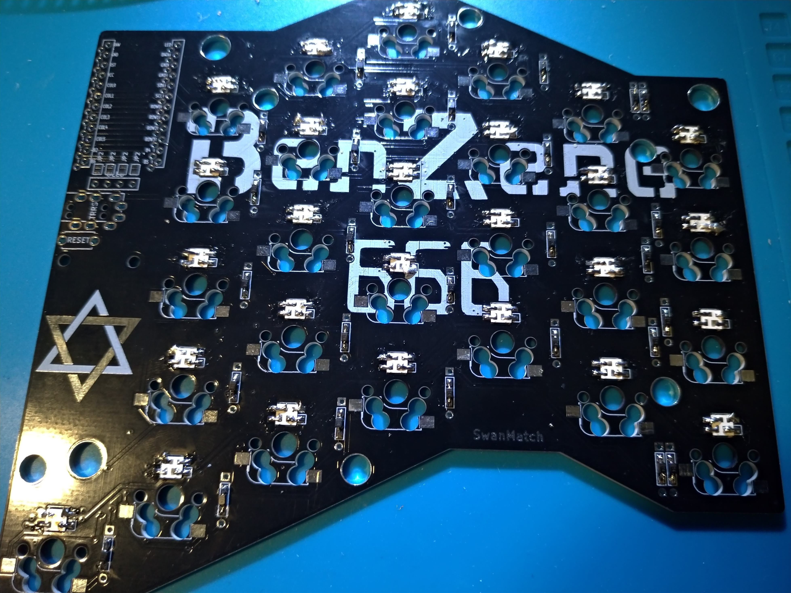
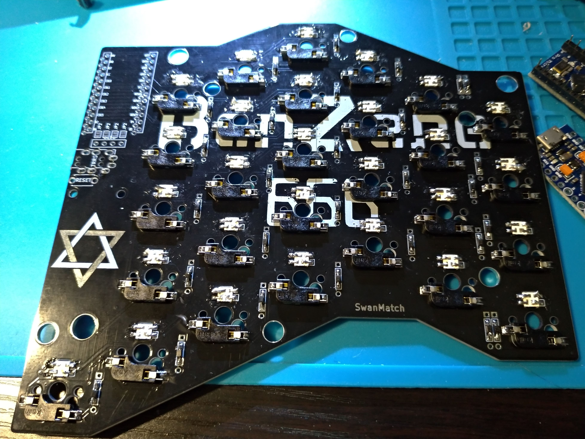
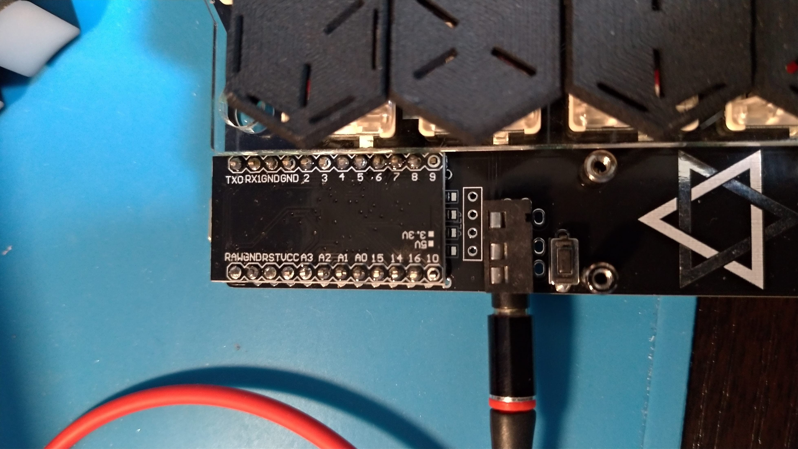

# benzene666ビルドガイド



## 材料



### キットに含まれるもの

| 品目             | 数量 |
| ---------------- | ---- |
| PCB              | 2枚  |
| トッププレート   | 2枚  |
| ボトムプレート   | 2枚  |
| OLED保護プレート | 2枚  |
| ProMicro         | 2個  |
| ダイオード       | 56個 |
| LED              | 56個 |
| Kailhソケット    | 56個 |
| M24mmネジ        | 28本 |
| 7mm六角スペーサ  | 12本 |
| 8mm丸スペーサ    | 4本  |
| 低頭ネジ         | 4本  |
| ゴム足           | 10本 |

### キット以外で必要なもの
| 品目                  | 数量 |
| --------------------- | ---- |
| スイッチ              | 56個 |
| キーキャップ          | 56個 |
| TRRSまたはTRSケーブル | 1本  |
| USBケーブル           | 1本  |

### オプション品

| 品目       | 数量 |
| ---------- | ---- |
| コンスルー | 4本  |
| M6ボルト   | 6本  |
| M6ナット   | 6個  |
| *)OLED     | 2個  |

OLEDは動作未検証です。


## 組み立て手順

### LED


LEDをはんだ付けします。

シルクで白く囲ってあるのが一番大きいパッドです。

温度調整はんだごてで220度くらいに設定してください。もたついてると壊れます。



### ダイオード

ダイオードをはんだ付けしてください。向きに気をつけてください。

スルーホールの場合は黒が上、表面実装の場合うっすら線が書いてあるほうが上です。



### ソケット

ソケットをはんだ付けしてください。



### TRRS、リセットスイッチ

はんだ付けしてください。

### ProMicro

ここだけは間違えるとリカバリが面倒なので、細心の注意をして作業にあたってください。

コンスルーを使う場合はHelixなどのビルドガイドを参考にしてください。

四角く囲ってあるところに付属のピンを指して裏からはんだ付けして、表面にProMicroを指してはんだ付けしてください。



### スイッチ

トッププレートにスイッチをはめて、PCBに刺します。

このときすべてのピンが真っすぐになっていることを確認してください。

ピンが折れてしまいます。

### OLED保護プレート

PCB裏側から丸スペーサーをネジ止めして、表側に保護プレートを挟み込む形で低頭ネジでとめます。

### プレート

六角スペーサーとネジでPCBをサンドします。

ボトムプレートにゴム足を貼り付けてください。

反対側も同様に組み立てます。

### ファームウェア

```sh
git clone https://github.com/swanmatch/qmk_firmware.git
cd qmk_firmware
make benzene:swan:avrdude
```

